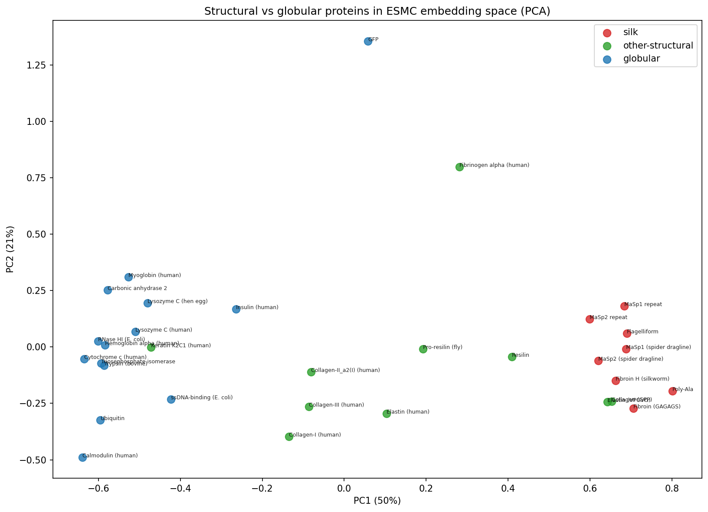
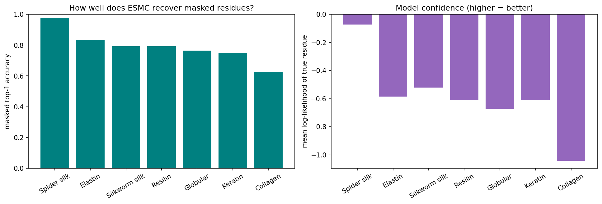
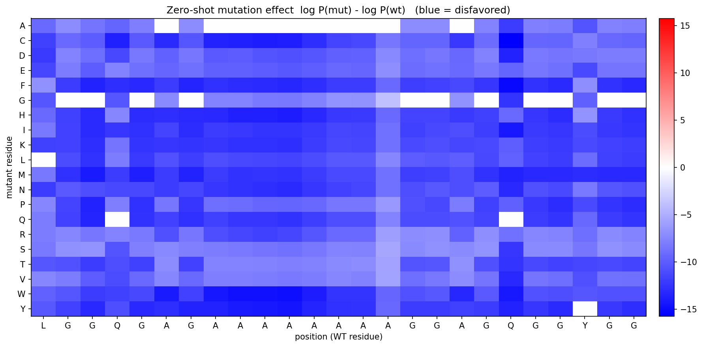
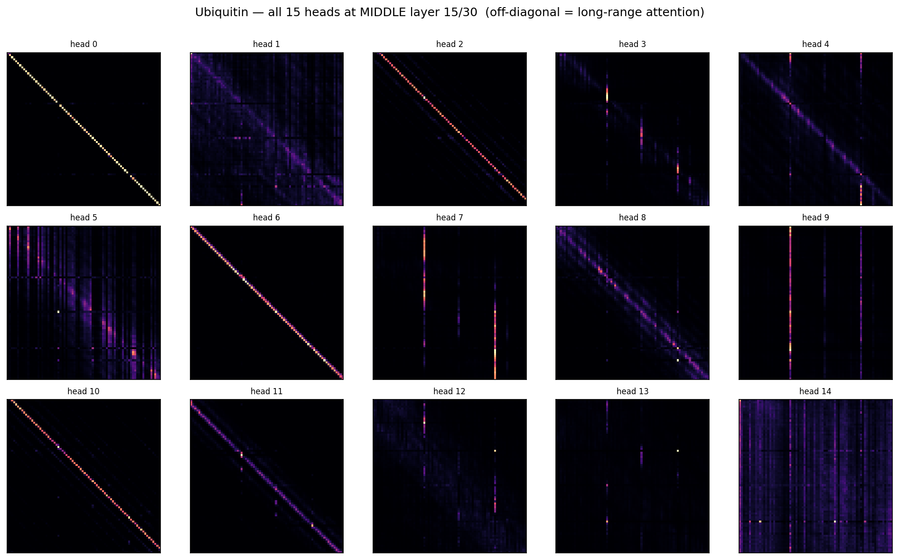
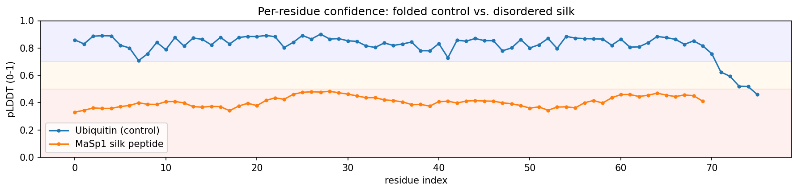
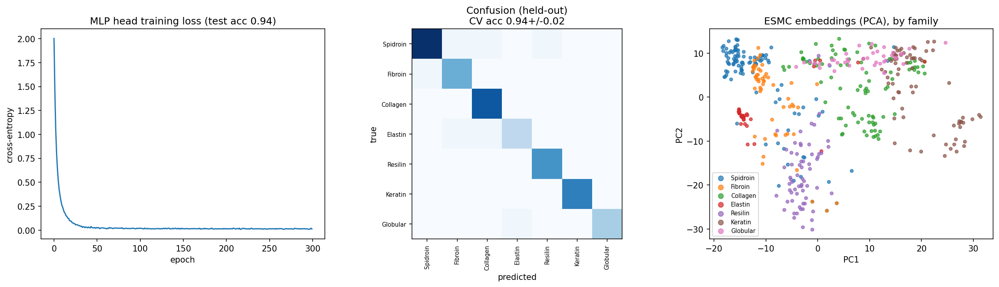
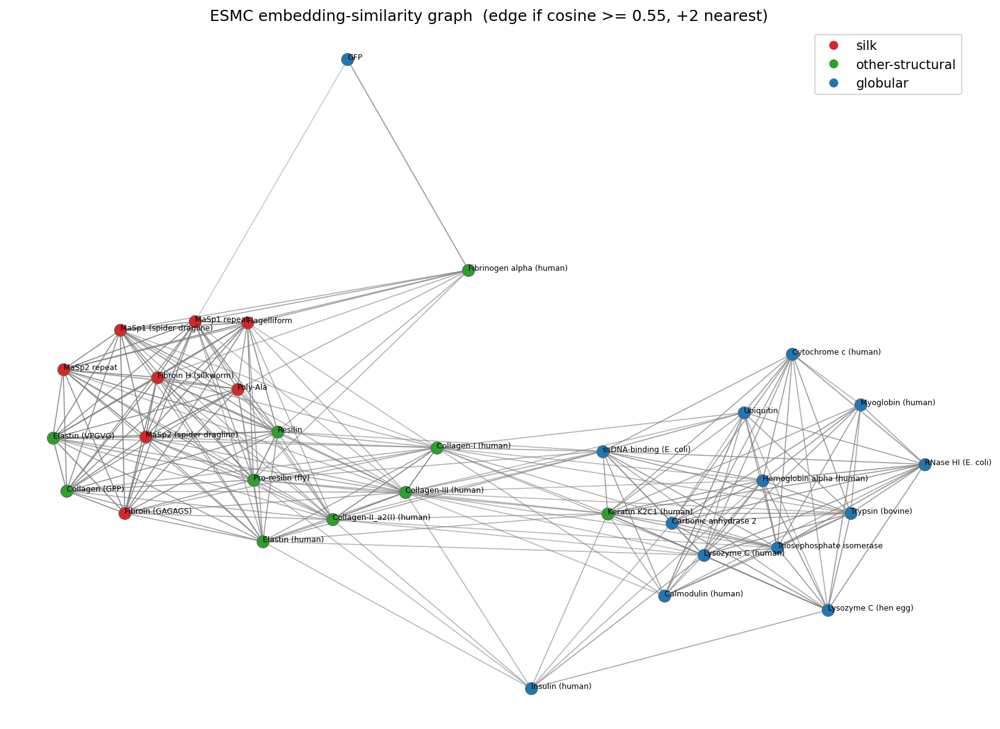
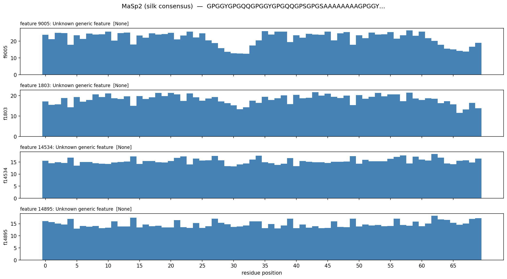
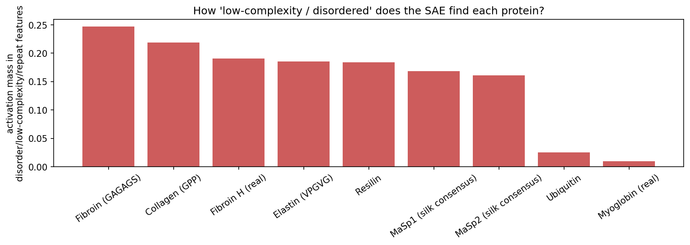
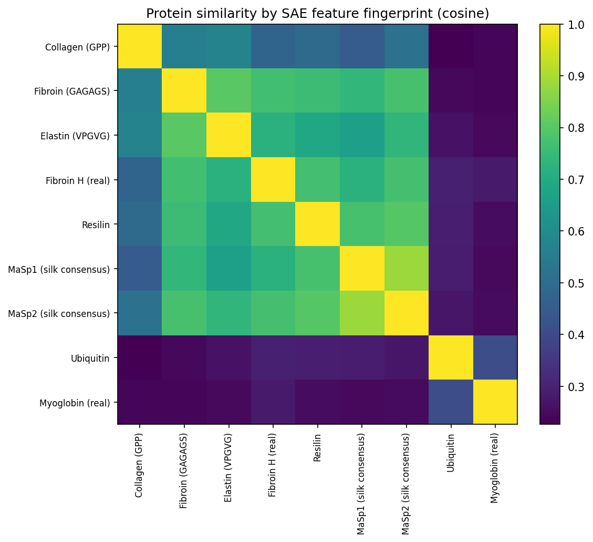

# Protein Language Models for Structural Proteins — ESMC, ESMFold2 & SAEs

Example notebooks that use the **EvolutionaryScale / Biohub** protein models to explore
**silk and other structural / biomaterials proteins** (spider dragline, silkworm fibroin, collagen,
elastin, resilin, keratin), with well-folded globular proteins as controls.

| Notebook | What it does | Open in Colab |
|----------|--------------|---------------|
| **`ESM_structural_proteins.ipynb`** | ESMC embeddings, masked-language modeling, in-silico mutational scanning, attention, **ESMFold2** structure prediction, a transfer-learning head, and an interactive relatedness graph | [](https://colab.research.google.com/github/lamm-mit/EvolutionaryScale-protein-mechanics/blob/main/ESM_structural_proteins.ipynb) |
| **`ESM_sae_structural_proteins.ipynb`** | **Sparse-autoencoder (SAE)** feature interpretation of ESMC-6B — *what concepts* the model uses for each material | [](https://colab.research.google.com/github/lamm-mit/EvolutionaryScale-protein-mechanics/blob/main/ESM_sae_structural_proteins.ipynb) |

---

## 1 · The models

| Model | Type | Size | Role here |
|-------|------|-----:|-----------|
| **ESMC** (`biohub/ESMC-300M / 600M / 6B`) | Masked **protein language model** (transformer; rotary, SwiGLU, pre-LN) | 0.3–6 B | Per-residue & whole-protein **embeddings**, masked-residue prediction, zero-shot variant scoring |
| **ESMFold2 / ESMFold2-Fast** (`biohub/ESMFold2*`) | **Structure prediction** (diffusion trunk on a frozen ESMC-6B backbone) | 0.2 B + 6 B backbone | All-atom 3-D structure + confidence (**pLDDT, pTM**) from a single sequence |
| **ESMC-6B SAE** (`biohub/ESMC-6B-sae-…`) | **Sparse autoencoder** on layer-60 embeddings | 16,384 features, k=64 | Decomposes embeddings into **interpretable features** with text descriptions |

**Protein language models (pLMs)** are trained by masking residues and predicting them across
hundreds of millions of natural sequences. In doing so they internalize the statistical "grammar" of
proteins — which residues co-occur, which substitutions are tolerated, what folds look like — and
expose it as a dense per-residue **embedding**. **ESMFold2** turns sequence into 3-D coordinates;
its per-residue **pLDDT** confidence (0–1 here) is itself informative. A **sparse autoencoder**
re-expresses each polysemantic embedding as a handful of approximately *monosemantic* features, many
of which correspond to recognizable biological concepts.

---

## 2 · The science: why structural proteins?

Silk, collagen, elastin, and resilin are **biomaterials**: their mechanics emerge from short sequence
**motifs** tiled into long repeats. That makes them an ideal probe for *what a protein language model
has actually learned*.

| Material | Signature motif | Structural role |
|----------|-----------------|-----------------|
| Spider dragline (MaSp1) | poly-Ala `(A)n` + `GGX` | β-sheet nanocrystals + amorphous matrix |
| Spider dragline (MaSp2) | `GPGGY`/`GPGQQ` + poly-Ala | elastic β-spirals + crystals |
| Silkworm fibroin | `GAGAGS` | antiparallel β-sheet crystallites |
| Collagen | `Gly-X-Y` (often `GPP`) | triple helix |
| Elastin | `VPGVG` | elastomeric β-turns |
| Resilin | `PSDSYGAP` | near-perfect rubber elasticity |

A recurring theme: silks are **intrinsically disordered in solution** and only order into β-sheet
nanocrystals upon spinning — so a single-chain structure predictor *should* report low confidence,
and an SAE *should* flag them as low-complexity/disordered. Both happen (see below).

---

## 3 · Setup

A dedicated conda environment (keeps the patched `transformers` away from your other envs):

```bash
conda create -n esm python=3.12 -y
conda activate esm
pip install "esm @ git+https://github.com/Biohub/esm.git@c94ed8d" jupyter ipykernel \
            py3Dmol scikit-learn matplotlib pandas joblib datasets pyarrow peft
python -m ipykernel install --user --name esm --display-name "Python (esm — ESMC/ESMFold2)"
```

Then open either notebook and select the **Python (esm — ESMC/ESMFold2)** kernel.

- The `esm` SDK installs a **patched `transformers`** that registers the `esmc` and `esmfold2`
  architectures (stock transformers does not recognize them).
- **Device:** code auto-detects CUDA → Apple-Silicon MPS → CPU. ESMC-300M runs anywhere. **ESMFold2
  and the ESMC-6B SAE run on CPU in float32** on Apple Silicon (MPS lacks a couple of required ops);
  this is fine with enough RAM (developed on a 128 GB Mac).
- **Downloads (cached after first use):** ESMC-300M ≈ 1.3 GB, ESMC-6B ≈ 25 GB, ESMFold2-Fast ≈ 0.8 GB,
  SAE layer-60 ≈ a few hundred MB.

---

## 4 · Notebook 1 — `ESM_structural_proteins.ipynb`

Sections: embeddings → embedding-space map → masked-LM → naturalness → mutational scan → attention →
**ESMFold2 folding** → transfer-learning head → interactive graph. Every figure is saved to
[`results/`](results/) as PNG **and** SVG.

**Embedding space (PCA).** Mean ESMC embeddings of ~30 proteins; silks, other-structural, and
globular proteins separate without any supervision.



**Which family does ESMC model best?** Masked-residue recovery across families — repetitive spider
silk is almost perfectly predictable (**top-1 ≈ 0.98**), diverse collagen the least (**≈ 0.62**).



**In-silico deep mutational scan.** Zero-shot `log P(mut) − log P(wt)` across a MaSp1 window — the
poly-alanine crystalline block is strongly constrained.



**Attention — long-range structure.** Averaged last-layer attention is mostly local; *individual
heads in a middle layer* on a folded protein (ubiquitin) reveal off-diagonal (long-range) contacts.



**ESMFold2 structure confidence.** Ubiquitin folds confidently (**pLDDT ≈ 0.82**); a silk peptide
does not (**≈ 0.41**) — a *feature of the biology*, since dragline silk is disordered until spun.



**Transfer learning.** A new head trained on *frozen* ESMC embeddings classifies material family;
evaluated honestly with 5-fold cross-validation on UniProt data augmented by sliding windows
(**CV accuracy ≈ 0.94 ± 0.02**, chance = 0.14).



**Interactive relatedness graph.** Proteins linked by ESMC-embedding similarity; live threshold /
k-NN / highlight controls in Jupyter.



*(Also in `results/`: cosine-similarity heatmap `04_…`, per-residue surprisal `06_…`, and the
all-heads/last-layer attention overview `08_…`.)*

---

## 5 · Notebook 2 — `ESM_sae_structural_proteins.ipynb`

Decomposes ESMC-6B's layer-60 embeddings into **16,384 sparse features** (top-64 active per residue)
and asks what each structural protein "uses". Adapted from Biohub's SAE cookbook tutorial but rebuilt
to run **locally** (the original uses the Forge API). Figures in [`results_sae/`](results_sae/).

**Motif-localized features.** The strongest features for a spider-silk sequence, plotted along the
chain — sharp peaks track specific motifs (poly-Ala crystals vs. `GPGXX` turns).



**Order vs. disorder.** Activation mass carried by *disorder / low-complexity / repeat* features per
protein — silks, elastin, and resilin score high; folded globular proteins score low. The SAE
recovers a biologically meaningful order/disorder axis.



**Feature fingerprints across families.** Proteins clustered by the cosine similarity of their
16,384-feature fingerprints; silks group together and separate from globular controls.



**Highlights from the auto-generated feature descriptions** (treat as hypotheses):
- Spider silk top features → *"Gly/Ser-rich disordered low-complexity regions"*, *"Secreted
  low-complexity adhesive repeats"*.
- **Collagen's unique feature → *"Collagen Gly–X–Y repeat detector"*** — the SAE literally has a
  collagen-repeat detector.
- Elastin's unique feature → *"Solenoid repeat register detector"*; ubiquitin → only generic features.

The notebook also **maps a feature onto a 3-D ESMFold2 structure** (local) and provides an interactive
protein × feature explorer.

---

## 6 · Command-line tools (`cli/`) & agent skill

Beyond the notebooks, [`cli/`](cli/) holds small **local** command-line tools (no API key) for the
most common jobs. Activate the env first (`conda activate esm`); every tool has `--help`.

| Tool | Purpose |
|------|---------|
| `esm_fold.py` | sequence / FASTA → 3-D structure (**PDB + mmCIF**) + pLDDT/pTM |
| `esm_embed.py` | ESMC embeddings (mean-pooled or per-residue) → `.npy` / `.csv` |
| `esm_mutscan.py` | zero-shot **deep mutational scan** (log-likelihood-ratio matrix) → CSV + heatmap |
| `esm_sae.py` | interpretable **SAE features** + descriptions (ESMC-6B) → CSV |
| `make_dataset.py` | build / push the structural-protein **dataset** from UniProt |
| `esm_train_head.py` | train a **family / property classifier** on frozen ESMC embeddings |
| `esm_predict.py` | apply a trained head to new sequences |

```bash
# fold one sequence to PDB + mmCIF (+ a confidence summary CSV)
python cli/esm_fold.py --seq MQIFVKTLTGKT...RGG --out folds --formats pdb,cif
# ...or a whole FASTA
python cli/esm_fold.py --fasta proteins.fasta --out folds

# zero-shot deep mutational scan with a heatmap
python cli/esm_mutscan.py --seq GGAGQGG...AAAAAAAA --out scan --plot scan.png

# interpretable SAE features for a silk peptide (ESMC-6B, local)
python cli/esm_sae.py --seq GGAGQGG...AAAAAAAA --topk 10 --out sae

# train a family classifier on the default Hub dataset, then predict on a new sequence
python cli/esm_train_head.py --out-dir head_model            # -> CV accuracy ~0.94 (7 families)
python cli/esm_predict.py --model-dir head_model --seq GPGGYGPGQQ...   # -> Spidroin 0.99

# train on YOUR data: any sequence/target columns, explicit train + test files
python cli/esm_train_head.py --train train.csv --test test.csv \
       --seq-column sequence --target family                  # categorical  -> classification

# regression on a numeric property (auto-detected from the column dtype)
python cli/esm_train_head.py --train data.csv --seq-column seq --target tm   # -> TEST R2 / MAE
python cli/esm_predict.py --model-dir head_model --seq MQIF...               # -> tm = 64.2

# LoRA fine-tuning of ESMC itself (PEFT) instead of a frozen head
python cli/esm_train_head.py --method lora --target family --lora-r 16 --epochs 4
python cli/esm_predict.py --model-dir head_model --seq GPGGYGPGQQ...         # loads the LoRA adapter
```

**Training data & flexibility.** `esm_train_head.py` predicts **any property** from sequence:
give it a **sequence column** and a **target column** and it trains a head on frozen ESMC embeddings.
The task is chosen automatically from the target's dtype — **categorical → classification**,
**numeric → regression** (override with `--task`). Data can be one dataset (cross-validated) or an
explicit `--train` / `--test` split, each a local CSV **or** a Hugging Face dataset repo (use
`repo:split`, e.g. `myds:validation`; if you pass only a HF `--train` that *has* a test/validation
split, it's used automatically). Two training methods via `--method`:
**`head`** (default) freezes ESMC and trains a small head (`--head {linear,mlp}`, linear =
LogisticRegression / Ridge); **`lora`** adds **LoRA adapters** to ESMC and fine-tunes end-to-end
(PEFT) with `--lora-r/--lora-alpha/--lora-dropout/--lora-target-modules` (the ESMC card's
`layernorm_qkv.1,out_proj,ffn.1,ffn.3` by default) — only ~0.4 % of weights are trained, and the
adapter is saved for `esm_predict.py`. With no data flags it pulls the
ready-made [`lamm-mit/structural-protein-families`](https://huggingface.co/datasets/lamm-mit/structural-protein-families)
dataset (471 windowed sequences, 7 families) and reaches **≈ 0.94 CV accuracy** (chance 0.14); on a
held-out split it scores ~0.98 accuracy, and a numeric demo target (glycine fraction) gives **R² 0.99**.

**Agent skill.** [`SKILL.md`](SKILL.md) documents the whole toolkit in an agent-readable form —
installation, environment notes, every tool's arguments, example invocations, and gotchas — so a
coding agent can install and drive these tools autonomously.

### 6.1 · Detailed option reference

Every tool prints full usage with `-h/--help`; the key options are summarized below. All tools accept
`--device {auto,cpu,cuda,mps}` (auto-detect; heavy models use CPU on Apple Silicon).

<details><summary><b><code>esm_fold.py</code></b> — sequence(s) → 3-D structure (PDB/mmCIF)</summary>

| option | default | meaning |
|--------|---------|---------|
| `--seq STR` / `--fasta FILE` | — | input; one or both (FASTA may hold many records) |
| `--out DIR` | `folds` | output directory |
| `--formats` | `pdb,cif` | comma list of file types to write |
| `--model` | `biohub/ESMFold2-Fast` | or `biohub/ESMFold2` (MSA-capable) |
| `--loops` / `--steps` | `3` / `50` | trunk recycles / diffusion sampling steps (lower = faster, rougher) |
| `--diffusion-samples` / `--seed` | `1` / `0` | samples per target / RNG seed |

Outputs `<out>/<name>.{pdb,cif}` per record + `<out>/fold_summary.csv` (name, length, pLDDT, pTM).
</details>

<details><summary><b><code>esm_embed.py</code></b> — ESMC embeddings → .npy / .csv</summary>

| option | default | meaning |
|--------|---------|---------|
| `--seq` / `--fasta` | — | input (one or both) |
| `--model` | `biohub/ESMC-300M` | `…600M` / `…6B` also valid |
| `--pool` | `mean` | `mean` → one vector/protein (`out.npy` N×d + `out.csv`); `none` → per-residue `out_<name>.npy` (L×d) |
| `--out` | `embeddings` | output prefix |
| `--batch-size` | `8` | sequences per forward pass |
</details>

<details><summary><b><code>esm_mutscan.py</code></b> — zero-shot deep mutational scan</summary>

| option | default | meaning |
|--------|---------|---------|
| `--seq` / `--fasta` | — | input (first record used if FASTA) |
| `--model` | `biohub/ESMC-300M` | language model |
| `--start` / `--end` | `0` / `-1` | window (0-based, end exclusive; `-1` = full length) |
| `--out` | `mutscan` | CSV prefix (20 AA × window of `log P(mut) − log P(wt)`) |
| `--plot PATH` | — | optional heatmap PNG |
</details>

<details><summary><b><code>esm_sae.py</code></b> — interpretable SAE features (ESMC-6B)</summary>

| option | default | meaning |
|--------|---------|---------|
| `--seq` / `--fasta` | — | input (one or both) |
| `--esmc` / `--sae` | `biohub/ESMC-6B` / `…-sae-k64-codebook16384` | backbone / SAE repo |
| `--layer` | `60` | SAE layer to use |
| `--topk` | `10` | features to report per sequence |
| `--rank` | `max` | rank by `max` activation (motif-like) or `prevalence` (broad) |
| `--describe` / `--no-describe` | on | fetch text descriptions (keyless endpoint) |
| `--save-matrix` | off | also dump the `(L×16384)` activations as `.npy` |
| `--out` | `sae` | CSV prefix → `<out>_<name>.csv` (feature_id, max, prevalence, label, category, summary) |
</details>

<details><summary><b><code>make_dataset.py</code></b> — build / push the dataset</summary>

| option | default | meaning |
|--------|---------|---------|
| `--per-family` | `40` | sequences fetched per family from UniProt |
| `--window` / `--stride` / `--max-windows` | `200` / `150` / `4` | sliding-window augmentation |
| `--out` | `data/structural_protein_families.csv` | local CSV path |
| `--push` | off | upload to the Hub via `datasets` (parquet → working viewer) |
| `--repo` | `lamm-mit/structural-protein-families` | target dataset repo |
</details>

<details><summary><b><code>esm_train_head.py</code></b> — train a predictor for ANY property</summary>

| option | default | meaning |
|--------|---------|---------|
| `--train` | `--repo` | training data: local CSV **or** HF dataset repo id |
| `--test` | — | optional held-out CSV/HF repo; without it, cross-validate |
| `--repo` | `lamm-mit/structural-protein-families` | fallback dataset when `--train` omitted |
| `--seq-column` | `sequence` | input column |
| `--target` (`--label`) | `family` | output column — **categorical → classification, numeric → regression** |
| `--task` | `auto` | force `classification` / `regression` if needed |
| `--method` | `head` | `head` = frozen ESMC + small head; `lora` = LoRA fine-tune ESMC (PEFT) |
| `--head` | `linear` | (head method) `linear` = LogisticRegression / Ridge, or `mlp` (torch net) |
| `--model` | `biohub/ESMC-300M` | ESMC backbone |
| `--cv` | `5` | (head/linear) CV folds when no `--test` |
| `--epochs` | `300`/`4` | MLP head: 300; LoRA: 4 (if unset) |
| `--lr` | `1e-4` | learning rate (LoRA) |
| `--lora-r` / `--lora-alpha` / `--lora-dropout` | `8` / `16` / `0.05` | LoRA rank / scaling / dropout |
| `--lora-target-modules` | `layernorm_qkv.1,out_proj,ffn.1,ffn.3` | comma list (ESMC card defaults) |
| `--max-length` | `512` | (LoRA) token truncation length |
| `--max-samples` / `--batch-size` | `0` / `16` | row cap / batch size |
| `--out-dir` | `head_model` | saves `head.joblib`/`head.pt` (head) **or** the LoRA `adapter_*` + tokenizer; plus `meta.json` |

Reports CV / held-out **accuracy** (classification) or **R² + MAE** (regression). LoRA holds out 20 %
of train for validation when no `--test` is given.
</details>

<details><summary><b><code>esm_predict.py</code></b> — apply a trained head</summary>

| option | default | meaning |
|--------|---------|---------|
| `--model-dir` | (required) | directory written by `esm_train_head.py` |
| `--seq` / `--fasta` | — | sequences to score |
| `--topk` | `3` | classes to show (classification) |
| `--out PATH` | — | optional predictions CSV |

Classification → label + top-k probabilities; regression → predicted numeric value. Re-embeds with the
same ESMC model recorded in `meta.json`.
</details>

---

## 7 · Autoresearch — discovering architectures for silk-mechanics prediction

[`autoresearch_silk/`](autoresearch_silk/) is a self-contained, [Karpathy-style **autoresearch**
loop](https://www.verdent.ai/guides/what-is-autoresearch-karpathy): point a coding agent at the folder
and it iterates — *propose an architecture change → run a short training job → measure mean test R² →
keep it if it improved, else roll back* — to learn to predict silk fiber mechanics
(**toughness, E, strength, strain**) **directly from sequence** with ESMC.

**Why a search?** Using [`lamm-mit/silkome-full`](https://huggingface.co/datasets/lamm-mit/silkome-full)
(3197 train / 357 test, all four targets), this is a genuinely hard problem: ~3170 distinct sequences
map to only ~268 fiber measurements, so the single-sequence→mechanics signal is weak. We measured the
floor honestly — **mean-pool ESMC-300M baselines and classical models (Ridge/RandomForest/silk-type
mean) all sit at R² ≈ 0 or below**, even though 173/175 test property-tuples also appear in train. So
*any clearly positive, repeatable R² is a real result*, and the loop is pointed at the promising levers
(**LoRA fine-tuning**, **bigger backbone 600M/6B**, **per-residue sequence models**, target reframing).

**How it works**
```bash
conda activate esm                       # needs `huggingface-cli login` (silkome is private)
cd autoresearch_silk
python setup.py                          # ONE-TIME: cache ESMC embeddings (--model/--device configurable)
python run_experiment.py --tag baseline  # train model.py → print mean test R² → update leaderboard.md
```
The **editable asset** is `model.py` (architecture mapping residue embeddings → 4 targets); the agent
edits it (+ `config.json`), reruns the fixed `run_experiment.py`, and ratchets on `leaderboard.md`. Its
brief is in **`autoresearch_silk/program.md`**, and a ready-to-paste **kickoff prompt** for Claude
Code / Codex is in [`autoresearch_silk/README.md`](autoresearch_silk/README.md). The backbone is a one-line `config.json` switch
(`esmc_model`) + re-run `setup.py --model … --device cuda` — handy for a GPU box / DGX Spark.

> **Private data:** silkome is private, so `autoresearch_silk/data/` and `cache/` are git-ignored and
> **not** committed; re-run `setup.py` (with HF auth) to repopulate. Only code + the research
> brief/ledger/leaderboard are tracked.

## 8 · Repository layout

```
EvolutionaryScale-protein-mechanics/      # (local working folder: ESM_samples/)
├── ESM_structural_proteins.ipynb         # Notebook 1 (executed, with outputs)
├── ESM_sae_structural_proteins.ipynb     # Notebook 2 (executed, with outputs)
├── cli/                                   # command-line tools (fold, embed, mutscan, sae, train, predict)
│   ├── esm_common.py                      #   shared helpers (device, FASTA, batched embeddings)
│   ├── esm_fold.py  esm_embed.py  esm_mutscan.py  esm_sae.py
│   ├── make_dataset.py  esm_train_head.py  esm_predict.py
├── data/                                  # built dataset CSV (structural_protein_families.csv)
├── autoresearch_silk/                     # self-contained Karpathy-style autoresearch loop
│   ├── program.md  model.py  config.json  setup.py  dataio.py  run_experiment.py
│   ├── baselines/   leaderboard.md  journal.md          # (data/ & cache/ are git-ignored: private)
├── results/                               # Notebook 1 figures (PNG + SVG)
├── results_sae/                           # Notebook 2 figures (PNG + SVG)
├── SKILL.md                               # agent-readable description of the CLI toolkit
└── README.md
```

---

## 9 · Caveats and Notes

- pLMs/SAE outputs are **in-silico hypotheses**, not wet-lab annotations; SAE feature descriptions are
  auto-generated and can be wrong, especially for rare biology.
- ESMC has a **2048-residue** context window; long proteins (spidroins, fibroin) are sliced.
- The transfer-learning demo uses *stratified* CV; for a stricter test, split by source protein before
  windowing (group-aware CV) so windows from one protein don't straddle train/test.

## 10 · References

- ESMC / ESMFold2 model cards: <https://huggingface.co/biohub/ESMC-6B>, <https://huggingface.co/biohub/ESMFold2>
- ESMC SAE cards & ESM Atlas (feature descriptions): <https://huggingface.co/biohub>
- Candido et al., *Language Modeling Materializes a World Model of Protein Biology* (2026).
- Biohub `esm` SDK: <https://github.com/Biohub/esm>
